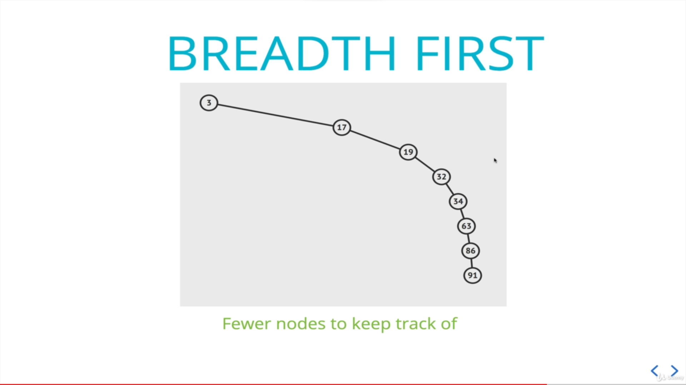
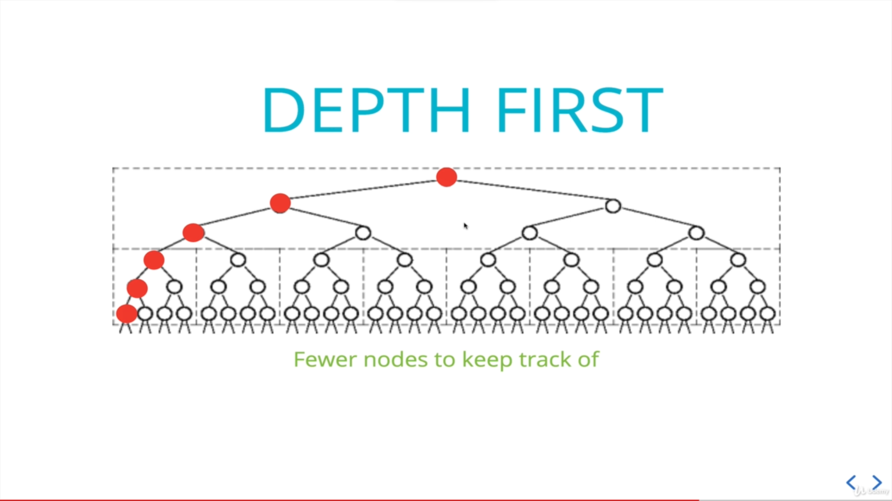

# Tree Traversal

## BFS (Breadth First Search)

 

- Use queue.
- Start with pushing root node to queue.
- Loop until queue is empty.
  - Shift node from queue and check for its value.
  - Push every child node to queue.
  - Repeat.

 

## DFS (Depth First Search)

 

## Types of DFS

Use Stack - Iteratively or Recursively

### PreOrder

- Start with the root node and check its value.
- Visit all the left node.
- Visit all the right node.

 

### PostOrder

- Visit all the left node.
- Visit all the right node.
- Finally check the value of node and move from down to up.

 

### InOrder

- Visit all the left node.
- Check the value of current node.
- Visit all the right node.

 

# Use case for BFS, DFS

Time complexity for BFS and DFS is same. So we will look for space complexity.

 

### If tree is narrow, Consider BFS

 

### If tree is wider, Consider DFS

 

# Use case for PreOrder, PostOrder, InOrder

## PreOrder

It can be used to copy or re-construct new tree from old tree.

 

## PostOrder

If we want to start looking from the leaves.

 

## InOrder

It can be used to get sorted data with BST.
