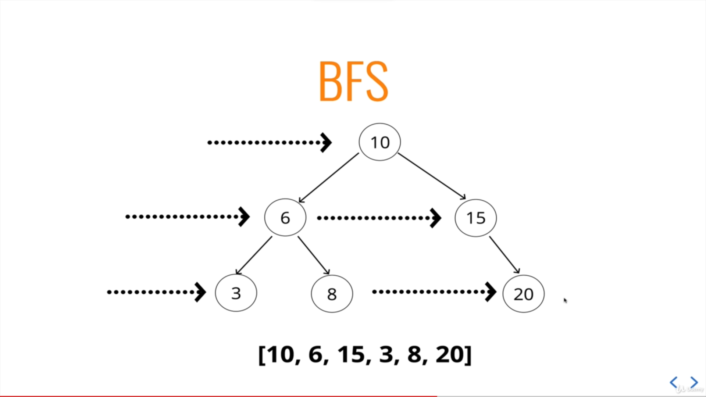

# Tree Traversal

## BFS (Breadth First Search)

 

- Use queue.
- Start with pushing root node to queue.
- Loop until queue is empty.
  - Shift node from queue and check for its value.
  - Push every child node to queue.
  - Repeat.

 

## DFS (Depth First Search)

 

## Types of DFS

Use Stack - Iteratively or Recursively

### PreOrder

- Start with the root node and check its value.
- Visit all the left node.
- Visit all the right node.

 

### PostOrder

- Visit all the left node.
- Visit all the right node.
- Finally check the value of node and move from down to up.

 

### InOrder

- Visit all the left node.
- Check the value of current node.
- Visit all the right node.
