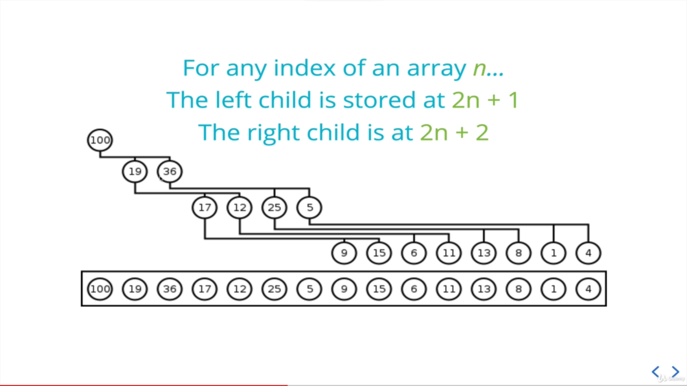
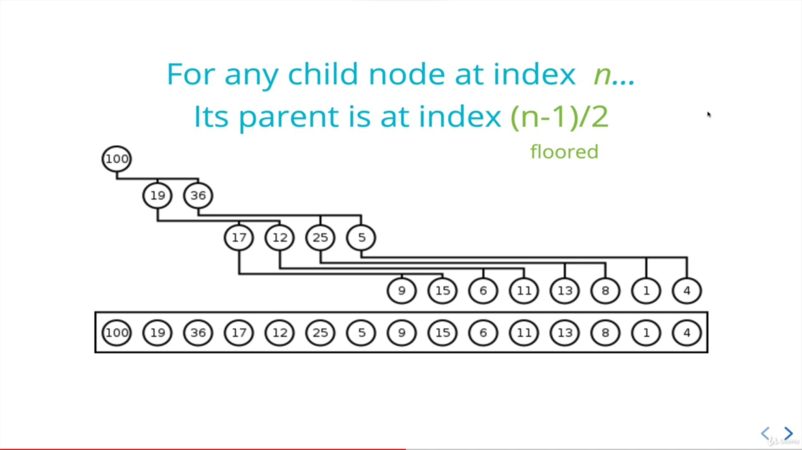

# Binary Heaps

Every left and right is filled before we move down and left children is filled out first.

## Min heaps

Parent node is always smaller than children node.

 

## Max heaps

Parent node is always greater than children node.

 

# Use case

Binarh heaps are used to implement priority queues, which are very commonly used data structure.

 

# Implementing binary heap in array

 

