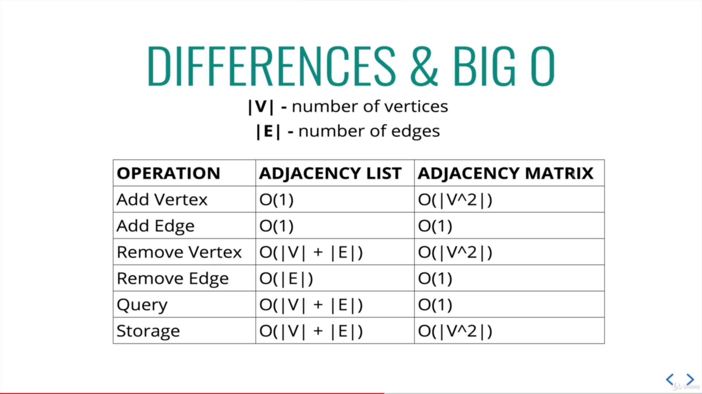

# Types of graph

## Directed graph

 

## Undirected graph

 

## Unweighted graph

 

## Weighted graph

 

# Storing graphs

## Adjacency matrix

 

## Adjacency list

 

## Difference between adjacency matrix and list

 

Usually, we can go with adjacency list. That's because there's rare chance of every node having connection with every node.
