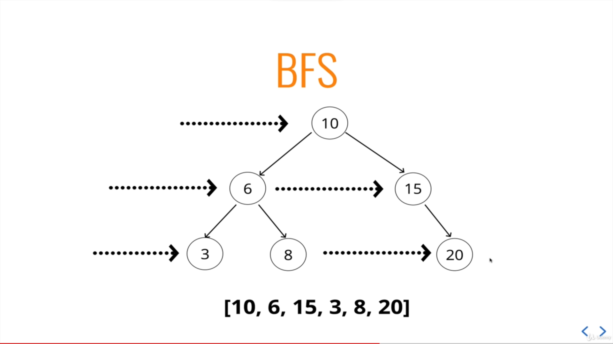

# Trees application

- HTML DOM
- Network Routing
- Abstract syntax tree
- AI & ML
- File system

 

# BST (Binary Search Tree)

- Every parent node has at most two children.
- Every node to the left of a parent node is always lesser and greater at right.

 

# Tree Traversal

## BFS (Breadth First Search)

 

## DFS (Depth First Search)

 

### Types of DFS

- InOrder
- PreOrder
- PostOrder
