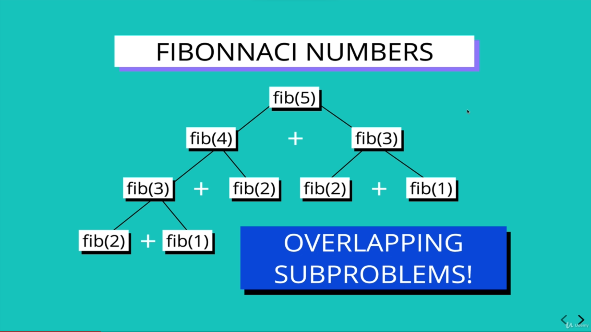
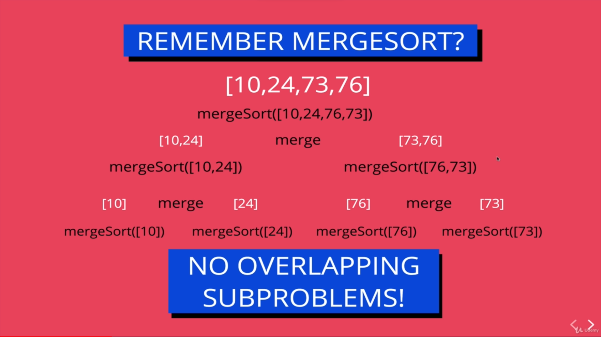
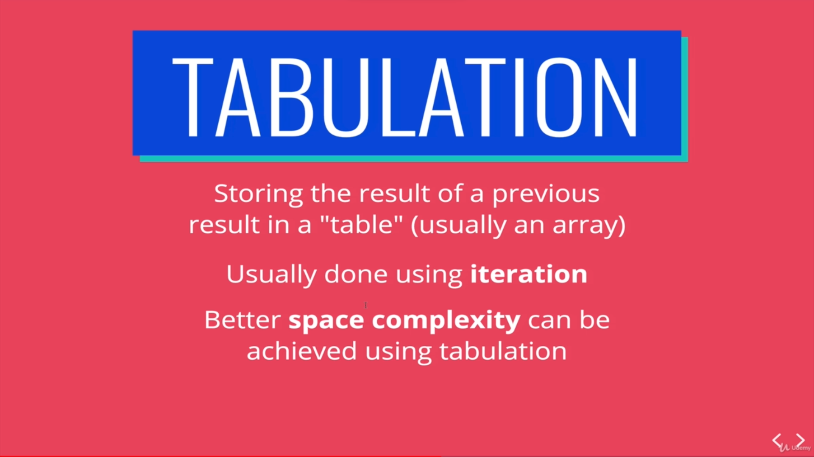
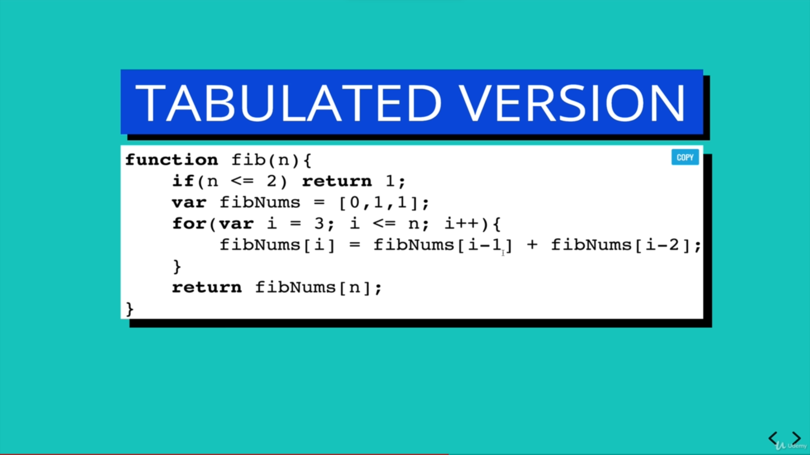

# Dynamic programming use cases

- There must be overlapping sub-problems. Meaning, sub-problems must be re-usable.
- There must be optimal solution.

 

 

 

# Time complexity

Time complexity for memoized recursion is roughly,

## O(n)

 

# Tabulation

 

